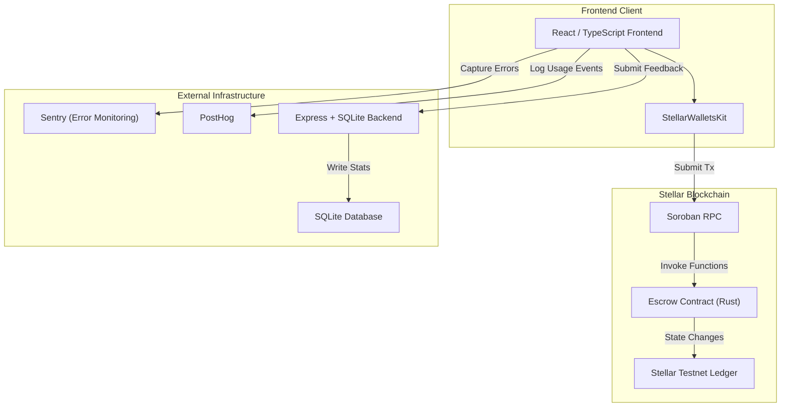
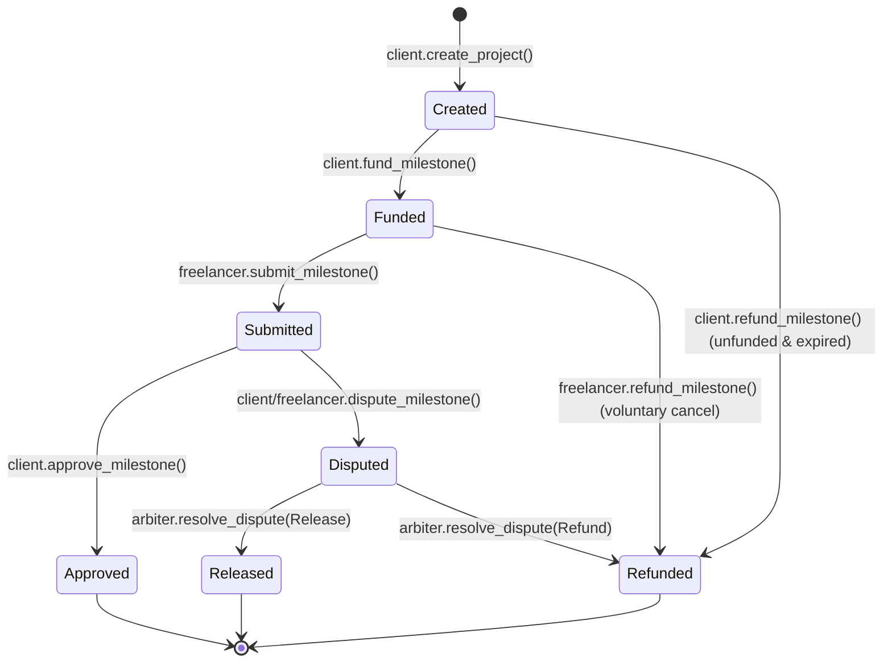

# Milestora

### Trustless milestone-based payments for the global freelance economy, built on Stellar

---

## 📖 Overview

Milestora addresses the critical challenge of trust and payment security in the global digital freelance economy. In traditional freelance arrangements, clients risk paying for incomplete or low-quality work, while freelancers face the risk of non-payment or delayed payouts after dedicating time and resources to a project. Milestora resolves these pain points by utilizing decentralized, milestone-based smart contracts built natively on Stellar's Soroban smart contract platform.

By locking project funds into a secure, decentralized escrow contract, clients demonstrate verified financial commitment upfront. Freelancers can inspect the ledger to confirm that the funds are secured on-chain before commencing work. The locked capital is released progressively as milestones are completed, reviewed, and approved. A dedicated arbiter role ensures fair dispute resolution, protecting both parties against performance conflicts.

Designed for freelancers, independent contractors, small agencies, and clients, Milestora combines the security and transparency of decentralized finance with a user-friendly, responsive interface. It offers a smooth onboarding experience that abstract Web3 complexities behind standard user flows, ensuring accessibility for non-technical users.

---

## 🌐 Live Demo & Deliverables

*   **Live Web Application**: `[LIVE_DEMO_URL]`
*   **Pitch Deck Presentation**: `[PITCH_DECK_LINK]`
*   **Demo Video Walkthrough**: `[DEMO_VIDEO_LINK]` *(1-2 minute walkthrough of key user flows)*

---

## ✨ Key Features

*   **Multi-Wallet Connection**: Seamless connection to the Stellar Testnet using Freighter, Albedo, xBull, or Lobstr wallets via `StellarWalletsKit`.
*   **Decentralized Project Creation**: Clients can initialize a project with multiple, distinct milestones (specifying amount, description, and deadline) directly on-chain.
*   **On-Chain Escrow Funding**: Security of funds achieved by locking the required XLM into the escrow contract per milestone.
*   **State-Driven Milestone Flow**: Comprehensive step-by-step workflow covering milestone creation, funding, submission, approval, and dispute resolution.
*   **Arbiter Dispute Resolution**: Ability to flag milestones in dispute, locking funds until resolved by a designated arbiter address.
*   **Real-Time Status Dashboard**: Status updates showing current milestone progress, balances, and next actions.
*   **Mobile-Responsive Redesigned UI**: A clean, premium dashboard layout designed for a great user experience on mobile, tablet, and desktop screens.
*   **Error Monitoring & Analytics**: Integration of Sentry for tracking runtime errors and custom event tracking to measure engagement and success rates.
*   **Integrated Feedback System**: Built-in feedback form capturing ratings and reviews to assess user satisfaction.
*   **Dark/Light Mode**: User interface adapts seamlessly to light and dark themes.

---

## 🏗️ Architecture

The system comprises a frontend React client, a rust-based Soroban contract, a backend telemetry and feedback server, and integration with third-party monitoring/analytics platforms.

### System Diagram



### Milestone State Machine

Milestone progress is governed by a finite state machine enforced by the smart contract:



*   **Created**: Milestone metadata is saved on-chain but no funds are committed.
*   **Funded**: The client deposits and locks XLM into the contract. It is now safe for the freelancer to work.
*   **Submitted**: Freelancer uploads deliverables and marks the milestone as complete.
*   **Approved**: Client accepts deliverables and releases funds to the freelancer's wallet address.
*   **Disputed**: Funds are locked because of a performance conflict, awaiting arbitration.
*   **Released**: The arbiter resolves the dispute in favor of the freelancer, releasing the escrowed funds.
*   **Refunded**: The arbiter resolves the dispute in favor of the client, refunding the locked funds.

---

## 🛠️ Tech Stack

| Layer | Technologies |
|---|---|
| **Frontend Framework** | React 19, TypeScript, Vite |
| **Styling** | CSS Variables, Tailwind CSS v4 |
| **Smart Contracts** | Rust, Soroban SDK `v21.7.7` |
| **Wallet Integration** | `@creit.tech/stellar-wallets-kit`, Freighter |
| **Analytics** | `[ANALYTICS_TOOL]` (e.g. PostHog) |
| **Monitoring** | Sentry (React SDK) |
| **Deployment** | `[DEPLOYMENT_PLATFORM]` (e.g. Vercel) |

---

## 📜 Smart Contract Details

*   **Network**: Stellar Testnet
*   **Deployed Contract Address**: `CBDB6URCCFRKTLITC7FRRSR7363VJLZL44WH4TUUYL5B2HYXJ2F7Z7ON`
*   **Stellar Expert Link**: [View Contract on Stellar Expert](https://stellar.expert/explorer/testnet/contract/CBDB6URCCFRKTLITC7FRRSR7363VJLZL44WH4TUUYL5B2HYXJ2F7Z7ON)

### Contract Interface Functions

*   `create_project(client: Address, freelancer: Address, arbiter: Address, token: Address, milestones: Vec<Milestone>) -> u64`
    *   Initializes a project with a list of milestone inputs and returns a unique Project ID.
*   `get_project(project_id: u64) -> Project`
    *   Reads and returns the project structure from persistent storage.
*   `get_project_count() -> u64`
    *   Returns the total number of projects created.
*   `get_milestones(project_id: u64) -> Vec<Milestone>`
    *   Helper to get the milestone list of a project.
*   `fund_milestone(client: Address, project_id: u64, milestone_idx: u32)`
    *   Locks the milestone amount in XLM from the client's wallet into the escrow contract.
*   `submit_milestone(freelancer: Address, project_id: u64, milestone_idx: u32)`
    *   Freelancer submits the deliverables for review, changing the milestone state to Submitted.
*   `approve_milestone(client: Address, project_id: u64, milestone_idx: u32)`
    *   Releases the locked milestone funds from the contract to the freelancer.
*   `dispute_milestone(client: Address, project_id: u64, milestone_idx: u32, reason: String)`
    *   Flags a milestone as disputed, locking the funds and emitting the dispute details.
*   `resolve_dispute(arbiter: Address, project_id: u64, milestone_idx: u32, resolve_to_client: bool)`
    *   Arbiter decides the dispute, refunding the client or releasing the funds to the freelancer.
*   `refund_milestone(caller: Address, project_id: u64, milestone_idx: u32)`
    *   Enables expiry refunds for clients, or voluntary cancellations/refunds from the freelancer.

---

## 🚀 What's New in Level 5

Milestora has been upgraded to a production-grade Level 5 application with a fresh redesign, new functional components, and real testnet user validation:

1. **Complete UI/UX Redesign**:
   - Modern, fintech-grade visual identity using a deep navy and starry blue canvas with gold/lumen accent colors fitting the Stellar brand.
   - Built a comprehensive landing/intro page explaining the protocol with a 3-step visual guide (Lock funds → Submit work → Get paid) before wallet connection.
   - Refined the dashboard into card-based views with a stepper progress indicator for each milestone (`Created` → `Funded` → `Submitted` → `Approved/Released` or `Disputed`).
   - Integrated skeleton loading templates for high-fidelity loading states and a Dark/Light mode toggle.
2. **Advanced On-Chain Features**:
   - **Real-Time Notifications**: Integrated toast/banner notifications driven by real contract events when milestones are funded, submitted, approved, or disputed.
   - **Project Activity Timeline**: A real-time, on-chain event logger listing all transactions related to a project with clickable hashes leading directly to StellarExpert.
   - **User Profile & Reputation Tracker**: A reputation dashboard displaying past projects, completed milestones, and a reputation indicator (completion rate) calculated directly from on-chain history.
   - **Structured Disputes Flow**: Upgraded the simple dispute flag to a full modal collecting structured reason categories ("Quality of Work", "Late Delivery", etc.) and detailed client comments.
   - **Copy Utility**: Quick wallet and hash copy buttons with interactive tooltips throughout the interface.
   - **Dashboard Search & Filter**: Real-time project search and filtering by status (all, active, completed, disputed).
3. **Onboarding & User Growth**:
   - In-app Freighter wallet setup walkthroughs, Friendbot testnet XLM funding utility, and shareable escrow invitation links.

---

## ⚙️ Getting Started / Local Setup

### Prerequisites
*   Node.js: version `v18+` or `v20+`
*   Rust toolchain and `wasm32-unknown-unknown` target.
*   `stellar-cli` (Stellar CLI `v26.0.0+` or `v27.0.0+`)
*   Freighter Wallet browser extension (connected to Testnet)

### Local Development Steps

1.  **Clone the Repository**:
    ```bash
    git clone [REPO_URL]
    cd Milestora
    ```

2.  **Configure Environment Variables**:
    Create a `.env` file in the `frontend` folder:
    ```env
    VITE_CONTRACT_ID=CBDB6URCCFRKTLITC7FRRSR7363VJLZL44WH4TUUYL5B2HYXJ2F7Z7ON
    VITE_RPC_URL=https://soroban-testnet.stellar.org
    VITE_NETWORK_PASSPHRASE="Test SDF Network ; September 2015"
    VITE_TOKEN_ADDRESS=CDLZFC3SYJYDZT7K67VZ75HPJVIEUVNIXF47ZG2FB2RMQQVU2HHGCYSC
    VITE_POSTHOG_TOKEN=[YOUR_POSTHOG_TOKEN]
    VITE_SENTRY_DSN=[YOUR_SENTRY_DSN]
    ```

3.  **Install Frontend Dependencies**:
    ```bash
    cd frontend
    npm install
    ```

4.  **Run Development Server**:
    ```bash
    npm run dev
    ```

5.  **Build Smart Contract WASM**:
    From the root directory:
    ```bash
    stellar contract build
    ```

6.  **Deploy Smart Contract**:
    ```bash
    stellar contract deploy --wasm target/wasm32v1-none/release/escrow_contract.wasm --source-account default --network testnet
    ```

---

## 💡 How to Use

### Client Workflow
1.  **Connect Wallet**: Click "Connect Wallet" on the top right and approve connection in Freighter.
2.  **Create Project**: Click "Create Escrow". Enter the Freelancer's address, the Arbiter's address, and define the milestones. Submit the transaction and sign with Freighter.
3.  **Fund Milestone**: Locate the newly created project. Under the milestone list, click **"Fund Milestone"** and sign the deposit transaction.
4.  **Review & Approve**: Once the freelancer submits their work, click **"Approve & Release"** to dispatch the escrowed funds to the freelancer's wallet.
5.  **Initiate Dispute**: If the work is incomplete or incorrect, click **"Dispute Work"** to lock the funds and escalate to the Arbiter with a structured reason and details.

### Freelancer Workflow
1.  **Connect Wallet**: Log in using your Stellar public key.
2.  **View Assignments**: Check the Freelancer tab to view all projects assigned to your wallet address.
3.  **Track Funding**: Ensure the milestone status displays **"Funded"** before starting tasks.
4.  **Submit Milestone**: Once completed, click **"Submit Deliverables"** and sign the signature payload. Your client will be notified to review.

---

## 📸 Screenshots

*   `[SCREENSHOT: new landing page]`  -  
*   `[SCREENSHOT: redesigned dashboard - desktop]` - 
*   `[SCREENSHOT: mobile responsive UI]` -   
*   `[SCREENSHOT: activity timeline / notifications]` - 
*   `[SCREENSHOT: analytics dashboard showing real usage]` - 

---

## 📈 User Growth & Activity

As part of the Level 5 validation phase, we launched a testnet onboarding campaign targeting real clients and freelancers:
- **Total Unique Users**: `[USER_COUNT]` (Target: 50+ unique wallets)
- **Total Real On-Chain Transactions**: `[TRANSACTION_COUNT]`
- **Excel Sheet feedback data export**: `[EXCEL_SHEET_LINK]`

---

## 📝 Feedback Collection

Feedback is collected via our Google Form "Milestora — User Feedback".
*   **Google Form Fields**:
    *   Name
    *   Email
    *   Wallet Address
    *   What they did in the app
    *   Bugs faced
    *   Rating (1-5)
    *   Improvement suggestions
*   **Google Form Link**: `[GOOGLE_FORM_LINK]`
*   **Total Responses**: `[RESPONSE_COUNT]`
*   **Average Rating**: `[AVG_RATING]/5`

---

## 🔄 Product Iteration Based on Feedback

We iterated directly on product layout and features based on real user reviews:

| # | Feedback Theme | What Users Said | Change Made | Commit Link |
|---|---|---|---|---|
| 1 | Mobile Layout | "The project list looks crowded and squashed on narrow phone screens." | Redesigned dashboard using flexible card layout with full mobile/tablet responsive breakpoints. | `[COMMIT_LINK_1]` |
| 2 | Status Tracking | "Hard to know what the next action is for a milestone just from a text status." | Added step-by-step progress stepper (Created → Funded → Submitted → Approved) with custom badges. | `[COMMIT_LINK_2]` |
| 3 | Notifications | "I have to refresh to know if the developer submitted work or if payment is released." | Integrated real-time toast notification listener driven by on-chain Soroban events. | `[COMMIT_LINK_3]` |
| 4 | Copying addresses | "Manually selecting and copying long G-addresses from cards is annoying." | Added copy buttons with instant "Copied!" tooltips for all public keys and transaction hashes. | `[COMMIT_LINK_4]` |
| 5 | Dispute Clarity | "Disputes need structured categories rather than a simple unstructured text comment." | Built an improved dispute modal supporting reason dropdowns and structured statements. | `[COMMIT_LINK_5]` |

---

## 📊 Monitoring & Analytics

### Event Telemetry
We use `[ANALYTICS_TOOL]` (e.g. PostHog) to monitor operations, track metrics, and evaluate DApp usability. The following custom actions are tracked:
*   `wallet_connected`: Triggered when users connect Freighter.
*   `project_created`: Logs successful on-chain project creation.
*   `milestone_funded`: Emitted when clients lock funds.
*   `milestone_submitted`: Captured when freelancers present deliverables.
*   `milestone_approved`: Dispatched when funds are released.
*   `milestone_disputed`: Sent when a dispute is opened.

These statistics can be analyzed in real-time in the `[ANALYTICS_TOOL]` dashboard.

### Error Tracking & Stability
We have integrated **Sentry** to capture client-side runtime errors. Sentry logs:
*   Rejected browser signature requests.
*   Network disconnection warnings or RPC failure timeouts.
*   Validation errors in project configurations.

---

## 🧪 Testing

### Smart Contract Tests (Rust)
Smart contract logic is tested using Rust's built-in cargo testing framework.
To run tests:
```bash
cargo test --manifest-path contracts/escrow_contract/Cargo.toml --target-dir target_test -j 1
```
These tests cover:
*   Milestone state transitions (Created $\rightarrow$ Funded $\rightarrow$ Submitted $\rightarrow$ Approved).
*   Enforcement of client-only permissions for funding and approvals.
*   Dispute arbitration flows and correct token disbursement.
*   Prevention of double-funding or double-release.

### Frontend Application Tests
To run frontend React unit tests:
```bash
cd frontend
npm test
```
These tests verify correct formatting of XLM amounts to Stroops and validation check logic for milestones.

---

## 📂 Project Structure

```text
Milestora/
├── .github/
│   └── workflows/              # GitHub Actions CI/CD workflows
├── backend/
│   ├── db/                     # SQLite database schema and instance
│   ├── server.js               # Express API backend for feedback
│   └── package.json
├── contracts/
│   └── escrow_contract/
│       ├── Cargo.toml          # Smart contract dependencies configuration
│       └── src/
│           ├── lib.rs          # Main contract entrypoint
│           └── test.rs         # Soroban contract testing suite
├── docs/                       # Technical documentations and spec sheets
├── frontend/
│   ├── public/                 # Static assets
│   ├── src/
│   │   ├── assets/             # Images, icons, and branding
│   │   ├── components/         # Reusable UI component blocks
│   │   ├── hooks/              # Custom React hooks
│   │   ├── services/
│   │   │   ├── analyticsService.ts # Event logging implementation
│   │   │   ├── contractService.ts  # SDK contract interaction wrappers
│   │   │   └── feedbackService.ts  # Feedback submission interface
│   │   ├── types/              # TypeScript types and definitions
│   │   ├── App.css             # Main styling
│   │   ├── App.tsx             # Primary dashboard application
│   │   ├── index.css           # Global layout & utility styling
│   │   └── main.tsx            # React entrypoint
│   ├── package.json
│   ├── tsconfig.json
│   └── vite.config.ts
├── README.md                   # Project overview and setup guides
└── TRANSACTIONS_PROOF.md       # On-chain testnet simulation documentation
```

---

## 🗺️ Next Phase Roadmap

*   **Real Stellar Anchor integration**: Integration of Stellar Anchors (SEP-24) to support credit card and fiat currency deposits/withdrawals, converting directly to XLM or stablecoins inside the escrow contract.
*   **Multi-arbitrator dispute DAO**: A decentralized oracle consensus or multi-arbitrator mechanism to resolve disputes without a single point of failure.
*   **Mainnet Launch**: Security audits, optimization of gas/fees, and deployment of Milestora on the Stellar Mainnet.

---

## 📄 License

Distributed under the MIT License. See `LICENSE` for details.

